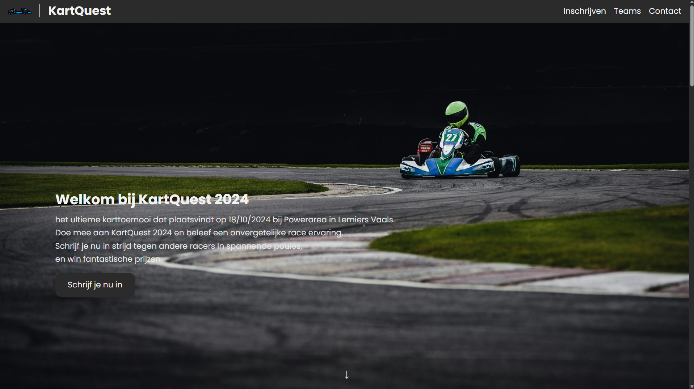
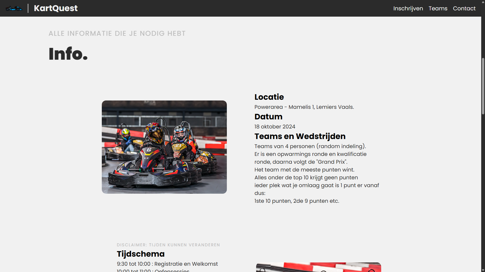
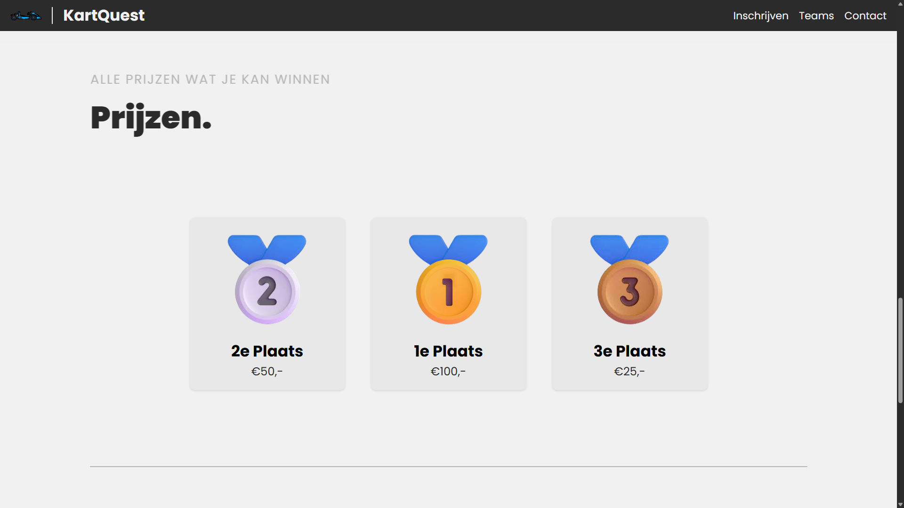
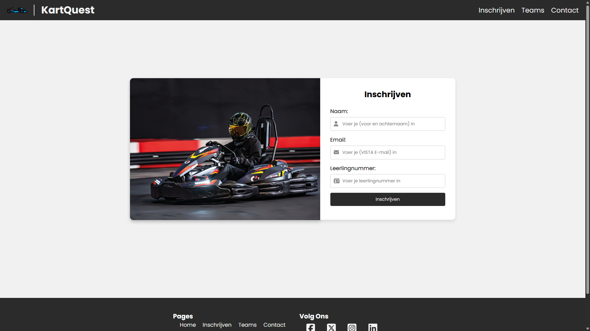
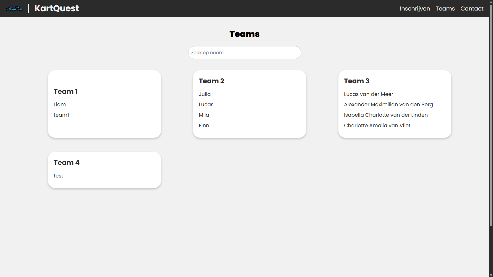

# Karting Event Management Systeem

Een volledig webapplicatie voor het beheren van karting evenement inschrijvingen en team formaties voor VISTA College studenten.

## Overzicht

Dit project bestaat uit drie hoofdonderdelen:

1. Backend API (Python/Flask)
2. Frontend Website (React/Vite)
3. Frontend Admin Panel (React/Vite)

## Preview

### Landing Page


De landing page verwelkomt studenten met informatie over het karting evenement dat plaatsvindt op 18/10/2024 bij Powerarea in Lemiers Vaals.

### Event Informatie


Gedetailleerde informatie over locatie, datum, teams en wedstrijdformat. Teams bestaan uit 4 personen met random indeling.

### Prijzen


Prijzen voor de top 3:

- 1e plaats: €100,-
- 2e plaats: €50,-
- 3e plaats: €25,-

### Inschrijfformulier


Gebruiksvriendelijk inschrijfformulier met validatie voor:

- Naam
- VISTA College e-mailadres
- 6-cijferig leerlingnummer

### Teams Overzicht


Overzicht van alle gevormde teams met zoekfunctionaliteit.

## Functionaliteiten

### Algemeen

- Studentenregistratie met e-mail verificatie (@vistacollege.nl)
- Validatie van leerlingnummers
- Automatische team formatie
- Teambeheer

### Backend

- RESTful API endpoints
- Database management
- Team formatie logica
- Beveiligingsfuncties

### Frontend Website

- Gebruiksvriendelijk registratieformulier
- Team overzicht
- Responsive design
- API integratie

### Frontend Admin Panel

- Teambeheer interface
- Registratie overzicht
- Gebruikersbeheer
- Beveiligde routes

## Technologie Stack

### Backend

- Python 3.12.0
- Flask (Web Framework)
- SQLAlchemy (ORM)
- MySQL (Database)

### Frontend (Website & Admin Panel)

- React.js
- Vite (Build tool)
- Node.js
- npm
- Axios (API calls)
- CSS/SCSS

## Projectstructuur

```
karting-event/
├── backend/           # Backend API
│   ├── app/          # Applicatie code
│   ├── config/       # Configuratie
│   ├── tests/        # Test bestanden
│   └── README.md     # Backend documentatie
└── frontend/         # Frontend applicaties
    ├── website/      # Publieke website
    │   ├── public/  # Statische bestanden
    │   ├── src/     # React code
    │   └── README.md
    ├── adminpanel/  # Admin interface
    │   ├── public/  # Statische bestanden
    │   ├── src/     # React code
    │   └── README.md
    └── README.md    # Frontend documentatie
```

## Installatie-instructies

### Vereisten

- Python 3.12.0
- MySQL Server
- Node.js (versie 14 of hoger)
- npm (meest recente versie)

### Backend Installatie

1. Navigeer naar de backend directory:

   ```powershell
   cd backend
   ```

2. Maak en activeer een virtuele omgeving:

   ```powershell
   python -m venv venv
   .\venv\Scripts\activate
   ```

3. Installeer de benodigde packages:

   ```powershell
   pip install -r requirements.txt
   ```

4. Stel de omgevingsvariabelen in:

   - Maak een ENV
   - zet daar je link naar de DB

5. Initialiseer de database:

   ```powershell
   flask db upgrade
   ```

6. Start de ontwikkelserver:
   ```powershell
   python app.py
   ```

### Frontend Website Installatie

1. Navigeer naar de website directory:

   ```powershell
   cd frontend/website
   ```

2. Installeer de benodigde packages:

   ```powershell
   npm install
   ```

3. Start de ontwikkelserver:
   ```powershell
   npm run dev
   ```

### Frontend Admin Panel Installatie

1. Navigeer naar de admin panel directory:

   ```powershell
   cd frontend/adminpanel
   ```

2. Installeer de benodigde packages:

   ```powershell
   npm install
   ```

3. Start de ontwikkelserver:
   ```powershell
   npm run dev
   ```

## API Endpoints

### Registratie

- `POST /api/inschrijvingen`
  - Registreer een nieuwe student
  - Verplichte velden: gebruikersnaam, e-mail, leerlingnummer
  - E-mail moet eindigen op @vistacollege.nl
  - Leerlingnummer moet 6 cijfers bevatten

### Teams

- `GET /api/teams`
  - Haal alle teams op met hun leden

## Beveiligingsfuncties

### Backend

- Honeypot veld voor spam preventie
- E-mail domein validatie
- Leerlingnummer validatie
- Unieke e-mail en leerlingnummer beperkingen
- Environment variabelen voor gevoelige data

### Frontend

- Environment variabelen voor API URLs
- Input validatie
- Error handling
- Protected routes voor admin panel

## Ontwikkeling

### Backend

- Gebruik `flask run` voor development
- Voer tests uit met `pytest`
- Gebruik `flask db migrate` voor database migraties

### Frontend (Website & Admin Panel)

- Gebruik `npm run dev` voor development
- Gebruik `npm run build` voor productie builds
- Gebruik `npm run preview` om productie builds te testen
- Gebruik `npm run lint` voor code kwaliteitscontrole

## Licentie

Dit project is een portfolio demonstratie en is alleen bedoeld voor educatieve en demonstratiedoeleinden. Het project mag bekeken en lokaal gebruikt worden, maar niet gedeeld, gepubliceerd of commercieel gebruikt worden. Zie het [LICENSE](LICENSE) bestand voor de volledige voorwaarden.

### Toegestaan gebruik

- Het project bekijken en bestuderen
- Het project lokaal draaien voor demonstratiedoeleinden

### Niet toegestaan

- Het project publiceren of delen
- Het project in productie gebruiken
- Het project commercieel exploiteren
